# ⚽ Most Comprehensive Transfermarkt Dataset
### *Comprehensive Football/Soccer Dataset - 93,000+ Players*

[](https://github.com/salimt/football-datasets/blob/main/LICENSE)
[](https://github.com/salimt/football-datasets)
[](https://github.com/salimt/football-datasets)
[](https://github.com/salimt/football-datasets)
[](https://github.com/sponsors/salimt)
[](https://www.kaggle.com/datasets/xfkzujqjvx97n/football-datasets/)

> **Complete football/soccer datalake with 93000+ players from Transfermarkt. Includes player profiles, performance statistics, market values, transfer histories, injury records, national team data, and teammate relationships.**

---

## 📊 **Dataset Coverage**

- **🎯 Total Players**: 92,671 professional football players  
- **⚽ Total Teams**: 2,175 clubs worldwide  
- **🌍 Geographic Scope**: Global coverage of all major leagues  
- **📈 Data Categories**: 10 comprehensive data categories  

---

## 🗂️ **Complete Datalake Structure - all CSV files -**

# Example Data

[Check out a sample of the dataset to get started.](https://github.com/salimt/football-datasets/blob/main/README_data.md)

### **Player Data Categories** (7 categories)
```
datalake/transfermarkt/raw/
├── player_profiles/               
├── player_performances/          
├── player_market_values/         
├── player_transfer_histories/          
├── player_injury_histories/       
├── player_national_team_performances/ 
└── player_teammates_played_with/  
```

### **Team Data Categories** (3 categories)
```
datalake/transfermarkt/raw/
├── teams_details/                 
├── teams_competitions_seasons/    
└── teams_children/                
```

## What You Get (5.7M+ Records!) 🔥

### Player Intelligence (7 datasets)
- **92,671 Player Profiles**  
- **1,878,719 Player Performances**  
- **901,457 Player Market Values**  
- **1,101,440 Player Transfer Histories**  
- **143,195 Player Injury Histories**  
- **92,701 Player National Team Performances**  
- **1,257,342 Player Teammates Played With**  

### Club Data (3 datasets)
- **2,175 Teams Details**  
- **196,378 Teams Competitions Seasons**  
- **7,695 Teams Children**  

### Totals
- **Players Total Count:** 5,467,525  
- **Teams Total Count:** 206,248  
- **All Total Count:** 5,673,773  


## 🏗️ **Complete Data Schema & Entity Relationships**

```mermaid
erDiagram

    PLAYER_PROFILES {
        varchar player_id PK
        varchar player_slug
        varchar player_name
        varchar player_image_url
        varchar date_of_birth_url
        date    date_of_birth
        varchar place_of_birth_country
        varchar place_of_birth
        varchar height
        varchar citizenship_country
        varchar citizenship
        varchar position
        varchar foot
        varchar player_agent_url
        varchar player_agent
        varchar current_club_id FK
        varchar current_club_url
        date    joined
        date    contract_expires
        varchar social_media_url
        varchar social_media
        varchar player_main_position
        varchar player_sub_position
    }

    PLAYER_MARKET_VALUES {
        varchar player_id FK
        bigint  date_unix PK
        int     value
    }

    PLAYER_TRANSFER_HISTORIES {
        varchar transfer_id PK
        varchar player_id FK
        varchar season
        date    date
        varchar date_unformatted
        varchar from_team_id FK
        varchar from_team_url
        varchar from_team_name
        varchar to_team_id FK
        varchar to_team_url
        varchar to_team_name
        int     value_at_transfer
        varchar transfer_fee
    }

    PLAYER_PERFORMANCES {
        varchar player_id FK
        varchar season
        varchar competition_id FK
        varchar competition_url
        varchar competition_name
        varchar team_id FK
        varchar team_url
        varchar team_name
        int     nb_in_group
        int     nb_on_pitch
        int     goals
        int     own_goals
        int     assists
        int     subed_in
        int     subed_out
        int     yellow_cards
        int     second_yellow_cards
        int     direct_red_cards
        int     penalty_goals
        int     minutes_played
        int     goals_conceded
        int     clean_sheets
    }

    PLAYER_TEAMMATES_PLAYED_WITH {
        varchar player_id FK
        varchar teammate_id FK
        varchar player_with_url
        varchar player_with_name
        float   ppg_played_with
        int     joint_goal_participation
        int     minutes_played_with
    }

    PLAYER_INJURY_HISTORIES {
        varchar player_id FK
        varchar season
        varchar injury_reason
        date    from_date PK
        date    end_date
        int     days_missed
        int     games_missed
    }

    PLAYER_NATIONAL_TEAM_PERFORMANCES {
        varchar player_id FK
        varchar team_id FK
        varchar team_url
        varchar team_name
        date    first_game_date PK
        int     matches
        int     goals
    }

    TEAMS_DETAILS {
        varchar club_id PK
        varchar club_slug
        varchar club_name
        varchar logo_url
        varchar country_name
        varchar season_id
        varchar competition_id FK
        varchar competition_slug
        varchar competition_name
        varchar club_division
        varchar source_url
    }

    TEAMS_CHILDREN {
        varchar parent_team_id FK
        varchar parent_team_name
        varchar child_team_id FK
        varchar child_team_name
    }


    TEAMS_COMPETITIONS_SEASONS {
        varchar club_division
        varchar club_id          
        varchar competition_id    
        varchar competition_name
        int season_draws
        int season_goal_difference
        int season_goals_against
        int season_goals_for
        varchar season_id
        boolean season_is_two_point_system
        varchar season_league_competition_id
        varchar season_league_league_name
        varchar season_league_league_slug
        varchar season_league_level_level_name
        int season_league_level_level_number
        varchar season_league_season_id
        int season_losses
        varchar season_manager
        varchar season_manager_manager_id
        varchar season_manager_manager_name
        varchar season_manager_manager_slug
        int season_points
        int season_points_against
        int season_points_for
        int season_rank
        varchar season_season
        int season_total_matches
        int season_wins
        varchar team_name
    }


    COMPETITIONS {
        varchar competition_id PK
        varchar competition_slug
        varchar competition_name
    }

    %% RELATIONSHIPS
    PLAYER_PROFILES ||--o{ PLAYER_MARKET_VALUES : "has values"
    PLAYER_PROFILES ||--o{ PLAYER_TRANSFER_HISTORIES : "has transfers"
    PLAYER_PROFILES ||--o{ PLAYER_PERFORMANCES : "has performances"
    PLAYER_PROFILES ||--o{ PLAYER_TEAMMATES_PLAYED_WITH : "played with"
    PLAYER_PROFILES ||--o{ PLAYER_INJURY_HISTORIES : "has injuries"
    PLAYER_PROFILES ||--o{ PLAYER_NATIONAL_TEAM_PERFORMANCES : "national team"

    TEAMS_DETAILS ||--o{ TEAMS_CHILDREN : "parent/child"
    TEAMS_DETAILS ||--o{ TEAMS_COMPETITIONS_SEASONS : "plays in"
    COMPETITIONS ||--o{ TEAMS_DETAILS : "competition includes teams"

    PLAYER_TRANSFER_HISTORIES }o--|| TEAMS_DETAILS : "from/to team"
    PLAYER_PERFORMANCES }o--|| TEAMS_DETAILS : "performance for team"
    PLAYER_PERFORMANCES }o--|| COMPETITIONS : "performance in comp"
    PLAYER_NATIONAL_TEAM_PERFORMANCES }o--|| TEAMS_DETAILS : "national team"

```



---

## 📋 **Data Quality **

### **Data Quality Features**
- ✅ **Deduplication**: Content hashing prevents duplicate data
- ✅ **Incremental Updates**: Only changed data is reprocessed
- ✅ **Error Tracking**: Failed URLs logged for monitoring
- ✅ **Unicode Support**: Proper handling of international characters
- ✅ **Timestamp Tracking**: All records include update timestamps


## 🎁 **Why Raw Data? Because Freedom Matters!**

### 🔓 **Dive Into Raw Football Data**

**Most datasets give you a filtered, pre-processed view.**  
Working with raw football data lets you explore everything—from cleaning and organizing to deep analysis—giving you the opportunity to learn by doing.  

### 💡 **Learn Through Practice**
- **🎯 Explore Freely** – Investigate the data your way and discover patterns on your own  
- **🔬 Develop Analytical Skills** – Create your own metrics, KPIs, and ways of interpreting the game  
- **🤖 Experiment with Machine Learning** – Train models on raw features to understand player performance, tactics, and trends  
- **📊 Spot Hidden Insights** – Learn to uncover trends that pre-processed datasets might hide  

### 🚀 **Self-Learning Opportunities with Raw Data**

| **Raw Data Aspect** | **How You Can Learn** |
|:---|:---|
| **🏗️ Build Your Own Pipeline** | Gain hands-on experience cleaning, structuring, and preparing large datasets |
| **🔍 Deep Data Exploration** | Practice exploratory data analysis (EDA), spot anomalies, and discover patterns |
| **⚡ Efficient Data Handling** | Learn to query, filter, and transform large datasets effectively |
| **🎨 Visual Storytelling** | Create your own charts and visualizations to communicate insights clearly |
| **🔗 Combine Sources** | Merge data from matches, players, and events to see the bigger picture and draw richer conclusions |
| **📚 Learn Through Iteration** | Test different approaches, refine your methods, and see the impact of your analysis in real time |


---

## 💝 **Support This Project**

### 💖 **Sponsor the Datalake**
Help maintain and expand this valuable football dataset:

[](https://github.com/sponsors/salimt)

**Your sponsorship helps with:**
- 🚀 **Regular Data Updates**: Keep the dataset current
- 🌍 **Expanded Coverage**: Add more leagues and competitions
- 🔧 **Infrastructure Costs**: Server and storage maintenance
- 📊 **Data Quality**: Enhanced validation and processing

---

## 🤝 **Get In Touch**

### 💡 **Working on a Cool Project?**  
I’m always excited to collaborate on innovative football data projects. If you’ve got an idea, let’s make it happen together!  

### 📬 **Contact Me**  
- **GitHub**: [@salimt](https://github.com/salimt)  
- **LinkedIn**: [salimt](https://www.linkedin.com/in/salim-tasan)  
- **Issues**: Feel free to use GitHub Issues if you’ve got dataset-specific questions.
  
---

## 🌟 **Star the Repo**  
If you find this project useful, don’t forget to drop a star ⭐ on GitHub—it really helps others discover it too!  

[](https://github.com/salimt/football-datasets)


---

## 👨‍💻 **Contributing**

Contributions to the Nodeball Football Datalake are most welcome! If you want to contribute new fields, data improvements, or processing enhancements to this dataset, the instructions are quite simple:

### 🎯 **How to Contribute**

1. **Fork the repo**
2. **Set up your local environment**
3. **Analyze the datalake structure** in `datalake/` directory
4. **Start modifying data processing** or creating new data extraction scripts
5. **If it's all looking good, create a pull request** with your changes 🚀
   
### 📋 **Contribution Areas**

- **🐛 Data Quality**: Report inconsistencies or missing data
- **🔧 Processing Scripts**: Improve data extraction and validation
- **📊 New Data Categories**: Add new types of football data
- **🧹 Data Cleaning**: Help with validation and normalization
- **📝 Documentation**: Improve dataset documentation

---

`football-data` `soccer-dataset` `transfermarkt-data` `player-statistics` `football-analytics` `soccer-analytics` `sports-data` `football-research` `player-performance` `transfer-market` `football-database` `soccer-database` `sports-dataset` `football-datalake` `soccer-datalake`

---

**Built with ⚽ by [salimt](https://github.com/salimt)**

*"Complete football datalake - no player left behind."*
